<div align="center">


## SortLas - Interactive Algorithm & Data Structure Visualizer

*A modern desktop application for visualizing sorting algorithms and tree data structures through interactive, real-time animations.*

---


---

### 📚 Learning algorithms should be visual, intuitive and interactive.

</div>

---

# 📖 Overview

**SortLab** is an interactive desktop application designed to transform the way sorting algorithms and tree data structures are learned.

Rather than presenting algorithms as blocks of code or textbook pseudocode, SortLab brings every comparison, swap, recursion, partition and traversal to life through smooth real-time animations.

The application combines the strengths of **PyQt5** for desktop interface development and **Pygame** for high-performance graphical rendering to create a learning platform that is both visually engaging and technically informative.

Every visualization is carefully designed to expose the internal mechanics of an algorithm, allowing students to understand **what is happening**, **why it is happening**, and **how each algorithm progresses toward its final solution.**

---

# 🌟 Why SortLab?

Traditional algorithm learning usually looks like this:

```
Read pseudocode

↓

Imagine execution

↓

Hope you understood
```

SortLab changes the workflow into

```
Input Data

↓

Watch Algorithm Execute

↓

Understand Every Comparison

↓

Observe Every Swap

↓

Follow Live Variables

↓

Master the Algorithm
```

Instead of memorizing algorithms, learners experience them.

---

# ✨ Key Highlights

- 🎨 Modern dark-themed desktop interface
- ⚡ Real-time sorting animations
- 📚 Interactive algorithm education
- 🧠 Live pseudocode highlighting
- 🎯 Variable tracking
- 📊 Runtime statistics
- 🎮 Smooth Pygame rendering
- 🖥 Professional PyQt launcher
- 🌳 Binary Search Tree Visualizer
- 🌲 Ternary Tree Visualizer
- 🔍 Traversal demonstrations
- 📈 Complexity visualization
- 🎯 Educational UI

---
# 📸 Application Showcase

SortLab combines a modern desktop interface with rich real-time visualizations to make algorithm learning interactive and intuitive.

---

## 🏠 Main Application

The PyQt5 launcher serves as the central control panel where users can enter custom arrays, choose an algorithm, and launch the desired visualization.

<p align="center">
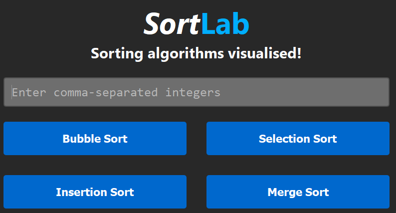
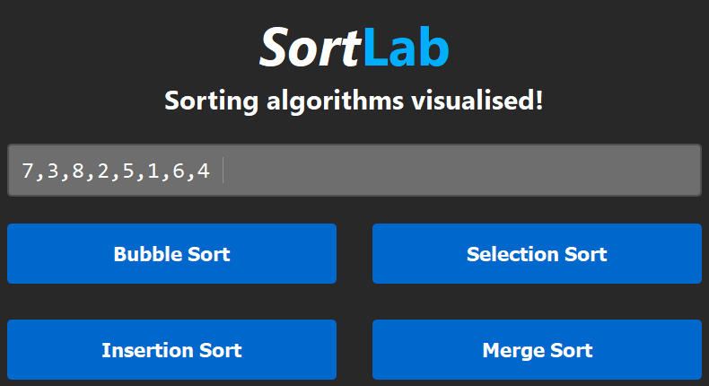
</p>

---

# 🔄 Sorting Algorithm Visualizers

Each algorithm is visualized independently with smooth animations, live statistics, and synchronized pseudocode highlighting.

---

## 🫧 Bubble Sort

Observe element comparisons, swaps, sorted regions, and live execution as Bubble Sort progresses step by step.

<p align="center">
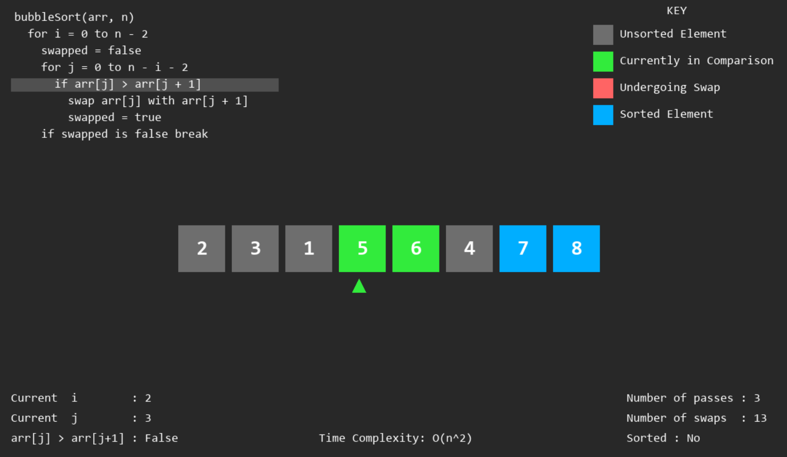
</p>

---

## 🎯 Selection Sort

Track the current minimum element, comparison process, and swap operations through intuitive color-coded animations.

<p align="center">
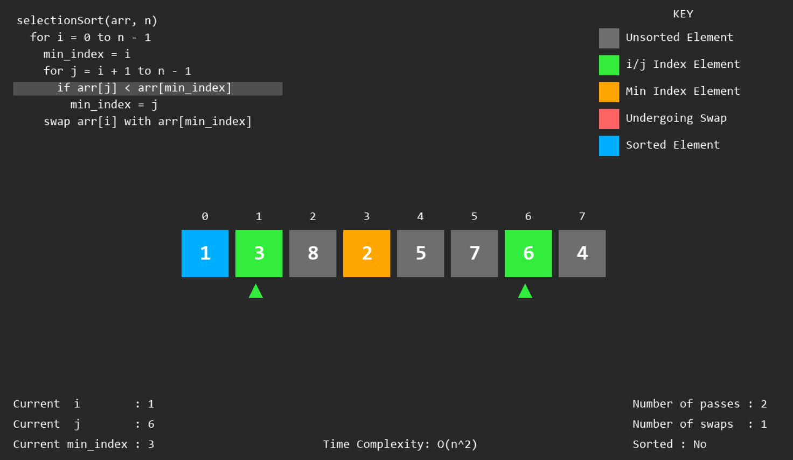
</p>

---

## 📥 Insertion Sort

Visualize shifting operations, insertion of the key element, and the gradual expansion of the sorted portion of the array.

<p align="center">
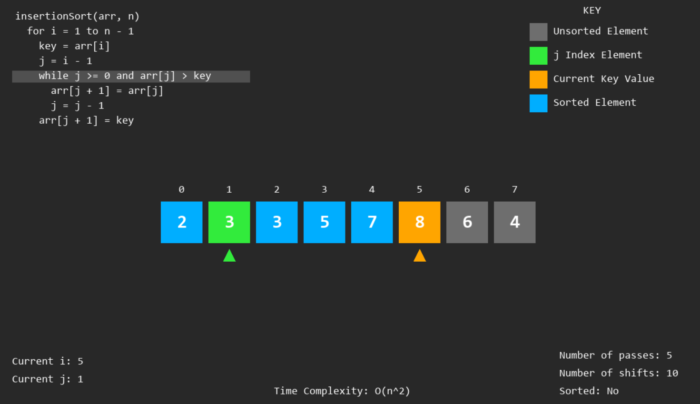
</p>

---

## 🔀 Merge Sort

Watch recursive partitioning and merging unfold with synchronized visual cues and detailed execution tracking.

<p align="center">
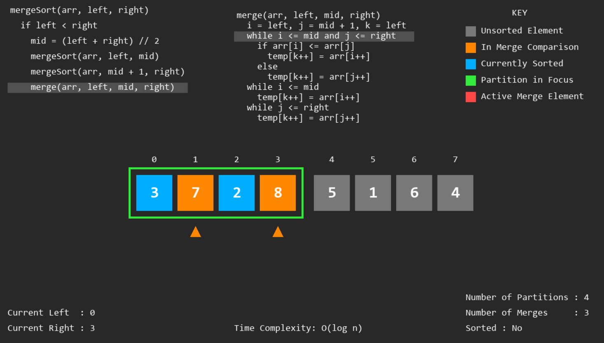
</p>

---

# 🔬 Visualization Features

Beyond simply displaying the algorithms, SortLab provides detailed educational overlays that expose the internal state of each algorithm while it executes.

---

## 📖 Live Pseudocode Highlighting

Every line of pseudocode is synchronized with the animation, allowing users to directly relate the visualization to the implementation.

<p align="center">
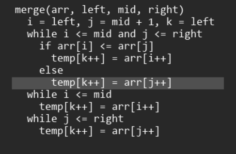
</p>

---

## 🎨 Colour Legend

Every colour used in the visualization is explained through a built-in legend, making it easy to distinguish comparisons, swaps, sorted elements, partitions and active regions.

<p align="center">
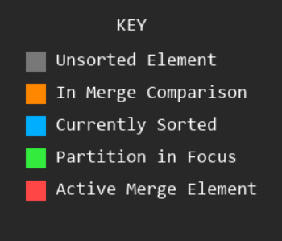
</p>

---

## 📍 Live Variable Tracking

Important variables and iterators are displayed in real time, allowing users to understand how the algorithm evolves internally.

<p align="center">
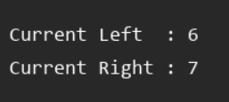
</p>

---

## 🔀 Merge Sort Execution Tracking

Merge Sort includes dedicated panels for monitoring recursive execution.

### Current Merge Step

<p align="center">
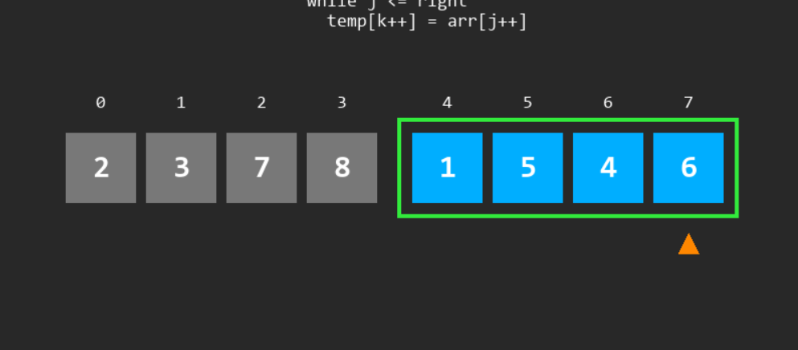
</p>

### Partition & Merge Statistics

<p align="center">
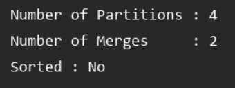
</p>

---

# ✨ What Makes SortLab Different?

Unlike conventional sorting visualizers, SortLab provides significantly richer educational context by combining:

- 🎬 Smooth frame-by-frame animations
- 📖 Live pseudocode highlighting
- 🎨 Colour-coded visualization
- 📍 Runtime variable tracking
- 📊 Algorithm statistics
- 🔀 Recursive execution monitoring
- 💻 Modern desktop interface
- 🎓 Interactive learning experience

Together, these features transform algorithm execution from abstract code into an intuitive visual process, making complex concepts substantially easier to understand.
---

# 🚀 Features

## 📊 Sorting Algorithm Visualizations

Currently supported algorithms include

- Bubble Sort
- Selection Sort
- Insertion Sort
- Merge Sort

Each visualization includes

- Animated execution
- Live pseudocode
- Variable tracking
- Colour-coded array states
- Time complexity display
- Current pass information
- Educational annotations

---

## 🌳 Tree Visualizers

Beyond sorting algorithms, SortLab also includes dedicated visualizers for tree-based data structures.

### Binary Search Tree

Supports

- Node insertion
- Node deletion
- Tree rendering
- Preorder traversal
- Inorder traversal
- Postorder traversal

### Ternary Tree

Supports

- Level-order tree construction
- Graphical visualization
- Preorder traversal
- Inorder traversal
- Postorder traversal

---

# 🎓 Educational Features

Unlike conventional visualizers, SortLab provides contextual information throughout execution.

Students can observe

- Current iteration
- Current comparison
- Current partition
- Current minimum
- Current key
- Number of passes
- Number of swaps
- Number of shifts
- Number of merges
- Number of partitions
- Sorted state
- Time complexity

This transforms the application into an interactive teaching aid rather than simply an animation player.

---

# 💡 Design Philosophy

SortLab was developed around one core objective:

> **Understanding algorithms should not require imagining invisible operations.**

Every comparison, recursive call, swap and traversal should be visible.

The application focuses on

- Visual Learning
- Incremental Understanding
- Clean User Experience
- Modular Software Design
- Reusable Visualization Components
- Educational Accessibility

---

# 🎯 Objectives

The project aims to

- Simplify algorithm learning
- Bridge theory with implementation
- Improve conceptual understanding
- Encourage experimentation
- Provide an engaging educational experience

The motivation for this design is also reflected in the accompanying project presentation, which emphasizes making algorithm execution easier to conceptualize through animated visual feedback. :contentReference[oaicite:2]{index=2}

---
---

# 🛠 Technology Stack

## Core Technologies

| Technology | Purpose |
|------------|---------|
| Python 3 | Core programming language |
| PyQt5 | Desktop GUI Framework |
| Pygame | Rendering & Animation Engine |
| CSV | Input Data Storage |
| Object-Oriented Programming | Modular Software Design |

---

## Development Tools

| Tool | Purpose |
|------|---------|
| Visual Studio Code | Development IDE |
| Git | Version Control |
| GitHub | Source Code Hosting |
| Python Virtual Environment | Dependency Isolation |

---

# 🏗 Software Architecture

SortLab follows a modular architecture where each visualization is implemented independently while sharing common rendering principles.

```
                    User

                      │

                      ▼

              PyQt5 Launcher

                      │

       ┌──────────────┼───────────────┐

       ▼              ▼               ▼

 Sorting Module   BST Module   Ternary Tree Module

       │              │               │

       ▼              ▼               ▼

   Pygame Engine  Pygame Engine  Pygame Engine

       │              │               │

       ▼              ▼               ▼

 Rendering Pipeline & Animation Engine

                      │

                      ▼

                Interactive Visualization
```

---

# 🎨 Application Workflow

```
Launch Application

        │

        ▼

Enter Input Array

        │

        ▼

Choose Algorithm

        │

        ▼

PyQt5 Launches

Selected Visualizer

        │

        ▼

Initialize Variables

        │

        ▼

Begin Animation Loop

        │

        ▼

Draw Current Frame

        │

        ▼

Update Algorithm State

        │

        ▼

Render New Frame

        │

        ▼

Repeat Until Sorted
```

---

# 🖥 User Interface Architecture

The application separates user interaction from graphical rendering.

```
PyQt5 GUI

│

├── Main Window

├── Input Fields

├── Buttons

├── Validation

└── Algorithm Selection

        │

        ▼

Visualization Engine

        │

        ├── Bubble Sort

        ├── Selection Sort

        ├── Insertion Sort

        ├── Merge Sort

        ├── Binary Search Tree

        └── Ternary Tree
```

This separation makes every visualization completely independent and easily extendable.

---

# ⚙ Rendering Engine

Every visualization follows a continuous rendering pipeline.

```
Algorithm Step

↓

Update Variables

↓

Update Colors

↓

Update Positions

↓

Render Array

↓

Render Statistics

↓

Render Pseudocode

↓

Render Legend

↓

Refresh Display
```

This allows smooth frame-by-frame animations while keeping the interface responsive.

---

# 🎮 Visualization Engine

Every algorithm visualization consists of several synchronized subsystems.

## Array Renderer

Responsible for

- Drawing array elements
- Scaling values
- Positioning
- Colours
- Labels

---

## Animation Controller

Responsible for

- Swap animations
- Smooth transitions
- Delays
- Timing
- Frame updates

---

## Statistics Panel

Displays

- Current pass
- Current iteration
- Swap count
- Shift count
- Merge count
- Partition count
- Sorted status
- Complexity

---

## Code Renderer

Displays

- Algorithm pseudocode
- Current execution line
- Highlighted statements
- Live execution progress

---

## Legend Renderer

Displays the meaning of every colour used during visualization.

Examples include

- Unsorted Element
- Compared Element
- Current Minimum
- Sorted Region
- Active Merge
- Pivot Element
- Active Partition

---

# 📂 Project Structure

```
SortLab

│

├── assets
│     Wallpapers
│     Icons
│     Images
│
├── algorithms
│
│     bubble_sort.py
│     selection_sort.py
│     insertion_sort.py
│     merge_sort.py
│
├── trees
│
│     bst.py
│     ternary_tree.py
│
├── ui
│
│     main_window.py
│
├── rendering
│
│     draw_array.py
│     animations.py
│     renderer.py
│
├── utils
│
│     csv_handler.py
│
├── requirements.txt
│
├── README.md
│
└── main.py
```

*(Adapt this section if your folder names differ.)*

---

# 📚 Supported Algorithms

| Algorithm | Visualization | Complexity Display | Variable Tracking |
|------------|--------------|-------------------|------------------|
| Bubble Sort | ✅ | ✅ | ✅ |
| Selection Sort | ✅ | ✅ | ✅ |
| Insertion Sort | ✅ | ✅ | ✅ |
| Merge Sort | ✅ | ✅ | ✅ |

---

# 🌳 Supported Data Structures

| Structure | Supported Operations |
|-----------|---------------------|
| Binary Search Tree | Insert • Delete • Traversals |
| Ternary Tree | Construction • Traversals |

---

# 📊 Complexity Reference

| Algorithm | Best | Average | Worst | Space |
|------------|------|----------|--------|--------|
| Bubble Sort | O(n) | O(n²) | O(n²) | O(1) |
| Selection Sort | O(n²) | O(n²) | O(n²) | O(1) |
| Insertion Sort | O(n) | O(n²) | O(n²) | O(1) |
| Merge Sort | O(n log n) | O(n log n) | O(n log n) | O(n) |

---

# 🔄 Visualization Pipeline

```
Input

↓

Algorithm Initialization

↓

Rendering Window

↓

Animation Loop

↓

Comparison

↓

Highlight

↓

Swap / Merge

↓

Update Statistics

↓

Update Code Highlight

↓

Render Frame

↓

Repeat

↓

Completed Visualization
```

---

# 🎓 Educational Design

SortLab has been developed as an educational platform rather than simply a demonstration program.

Every visualization has been carefully instrumented so learners can observe:

- Internal state transitions
- Intermediate algorithm states
- Variable evolution
- Decision making
- Recursion
- Traversals
- Element movement
- Data structure transformations

This transforms traditional textbook algorithms into interactive learning experiences.

---

# 🎨 User Experience Principles

The interface was designed around five principles:

- Simplicity
- Clarity
- Responsiveness
- Visual Feedback
- Progressive Learning

Animations are intentionally paced to allow users to follow every computational step without becoming overwhelmed.

---

# 💻 Performance

The visualization engine emphasizes smooth rendering while maintaining algorithmic accuracy.

Optimizations include:

- Efficient redraw cycles
- Incremental frame updates
- Minimal unnecessary rendering
- Lightweight animation timing
- Independent rendering modules

This ensures that even recursive visualizations such as Merge Sort remain responsive throughout execution.

---

---

# 🚀 Getting Started

## Prerequisites

Before running SortLab, ensure you have the following installed:

- Python 3.10+
- pip
- PyQt5
- Pygame

---

## Installation

Clone the repository

```bash
git clone https://github.com/devkailu/SortLab.git

cd SortLab
```

Install dependencies

```bash
pip install -r requirements.txt
```

If a requirements file is unavailable, install the dependencies manually:

```bash
pip install PyQt5
pip install pygame
```

---

# ▶ Running the Application

Launch the project using

```bash
python main.py
```

The PyQt launcher will open, allowing users to:

- Enter an input array
- Select an algorithm
- Launch the visualization

---

# 🧪 Example Input

```
8 5 1 4 7 2 6 3
```

or

```
12 6 18 9 3 15 21
```

Depending on the selected module, the input will be interpreted as an array or a tree.

---

# 📖 Feature Showcase

## Bubble Sort

✔ Animated Comparisons

✔ Swap Animation

✔ Sorted Region Highlighting

✔ Live Variable Tracking

✔ Complexity Display

✔ Pseudocode Highlighting

---

## Selection Sort

✔ Minimum Element Tracking

✔ Active Comparison Highlighting

✔ Sorted Region

✔ Swap Animation

✔ Live Statistics

---

## Insertion Sort

✔ Key Element Visualization

✔ Shift Operations

✔ Variable Tracking

✔ Sorted Prefix

✔ Live Pseudocode

---

## Merge Sort

✔ Recursive Partitioning

✔ Merge Visualization

✔ Temporary Array Representation

✔ Active Merge Region

✔ Recursive Pseudocode

---

## Binary Search Tree

✔ Node Insertion

✔ Node Deletion

✔ Dynamic Tree Rendering

✔ Tree Traversals

---

## Ternary Tree

✔ Tree Construction

✔ Multiple Child Visualization

✔ Traversals

✔ Animated Rendering

---

# 🎯 Educational Objectives

SortLab was designed to make abstract algorithmic concepts intuitive.

Students can observe:

- Every comparison
- Every swap
- Every recursive call
- Every partition
- Every merge
- Every traversal
- Every iteration

The application bridges the gap between textbook algorithms and practical execution by providing immediate visual feedback throughout the algorithm's lifecycle.

---

# 🏆 Engineering Highlights

This project demonstrates practical experience in:

### Desktop Application Development

- PyQt5 GUI Development
- Event Driven Programming
- Responsive Interfaces
- User Input Validation

---

### Graphics Programming

- Real-time Rendering
- Animation Pipelines
- Custom Drawing
- Frame Synchronization
- Visual Effects

---

### Data Structures & Algorithms

- Sorting Algorithms
- Tree Data Structures
- Recursive Algorithms
- Algorithm Optimization
- Time Complexity Analysis

---

### Software Engineering

- Object-Oriented Programming
- Modular Architecture
- Separation of Concerns
- Reusable Components
- Maintainable Codebase

---

# 📊 Project Statistics

| Category | Value |
|-----------|-------|
| Language | Python |
| GUI Framework | PyQt5 |
| Graphics Engine | Pygame |
| Visualization Modules | 6+ |
| Sorting Algorithms | 4 |
| Tree Visualizers | 2 |
| Rendering Style | Real-time Animated |
| Theme | Modern Dark UI |
| Application Type | Desktop |

---

# 📚 What I Learned

Developing SortLab provided hands-on experience with:

- Event-driven desktop application development
- Designing reusable visualization engines
- Real-time graphics rendering
- Animation timing and synchronization
- Object-oriented software design
- Recursive algorithm visualization
- Interactive educational software development
- Building intuitive user interfaces for technical concepts

---

# 🔮 Future Roadmap

The modular architecture makes SortLab easy to extend.

Future enhancements include:

## Sorting Algorithms

- Quick Sort
- Heap Sort
- Shell Sort
- Radix Sort
- Counting Sort
- Bucket Sort
- Tim Sort

---

## Graph Algorithms

- Breadth First Search
- Depth First Search
- Dijkstra's Algorithm
- Bellman-Ford
- Prim's MST
- Kruskal's MST
- Floyd-Warshall
- A* Pathfinding

---

## Advanced Trees

- AVL Trees
- Red-Black Trees
- B Trees
- B+ Trees
- Trie
- Segment Tree
- Fenwick Tree

---

## Dynamic Programming

Interactive visualization for

- Longest Common Subsequence
- Knapsack
- Matrix Chain Multiplication
- Fibonacci
- Edit Distance

---

## Additional Features

- Speed Control Slider
- Pause / Resume
- Step-by-Step Execution
- Reverse Animation
- Audio Feedback
- Export Animation
- Custom Themes
- Fullscreen Mode
- Complexity Comparison Dashboard
- Multi-algorithm Side-by-side Comparison

---

# 🤝 Contributions

Contributions are always welcome.

If you would like to:

- Improve animations
- Add algorithms
- Enhance the UI
- Optimize rendering
- Improve documentation

Feel free to fork the repository and submit a pull request.

---

# 👨‍💻 Author

<div align="center">

## Kailash Shankar R

**Computer Science Engineering Student**

Passionate about

Algorithms • Software Engineering • Full Stack Development • Artificial Intelligence • Visualization Tools

---

GitHub

https://github.com/devkailu

LinkedIn

https://www.linkedin.com/in/kailash-shankar-b5796b288/

Email

r.kailashshankar@gmail.com

</div>

---

# 🙏 Acknowledgements

Special thanks to

- Python Software Foundation
- Qt Framework
- Pygame Community
- Open Source Contributors
- Faculty and mentors who inspired this educational project

---

# 📜 License

This project was developed as an educational and portfolio project.

The source code is intended for learning, experimentation and academic reference.

---

<div align="center">

# ⭐ If you enjoyed SortLab, consider starring the repository!

It motivates future improvements and helps others discover the project.

---

## 🔷 SortLab

### Visualizing Algorithms. Inspiring Understanding.

Built with ❤️ using

**Python • PyQt5 • Pygame**

*"Because the best way to understand an algorithm is to watch it think."*

</div>
